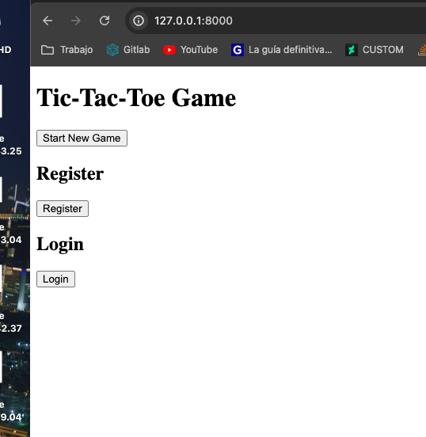
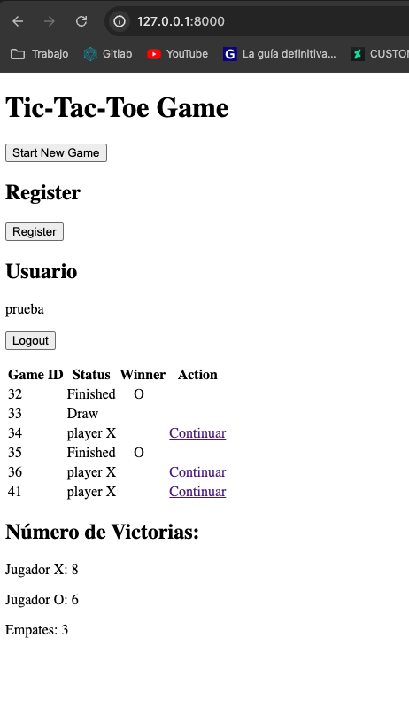
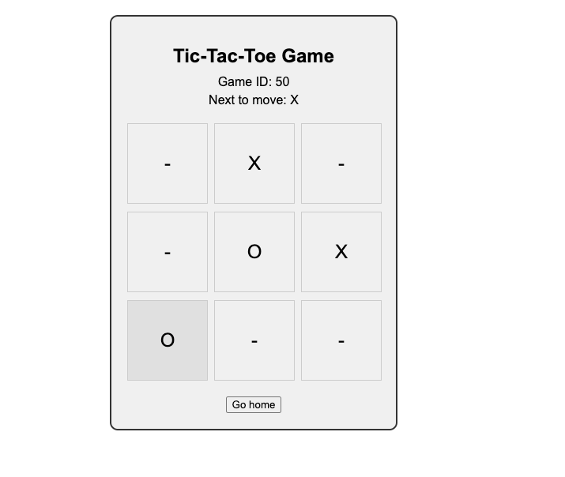

# Tic-Tac-Toe Game with User Authentication

Este proyecto implementa un juego básico de "Tic-Tac-Toe" (Tres en raya) utilizando Django.
## Características

- **Juego de Tic-Tac-Toe**: Los usuarios pueden jugar partidas de Tic-Tac-Toe en el sistema.
- **Autenticación de Usuarios**: Los usuarios pueden registrarse, iniciar sesión y cerrar sesión.
- **Historial de Partidas**: Los usuarios registrados pueden ver un historial de las partidas jugadas.


## Instalación y Uso

1. Clona este repositorio en tu máquina local:
2. Crea un entorno virtual y activa el entorno(opcional):
```bash
    python -m venv env
    source env/bin/activate (en Windows es env\Scripts\activate)
   ```
3. Instala las dependencias del proyecto:

```bash
    pip install -r requirements.txt
```
4. Aplica las migraciones para configurar la base de datos:

```bash
    python manage.py migrate
```
5. Ejecuta el servidor de desarrollo:

```bash
    python manage.py runserver
```

## Capturas de Pantalla

### Página de Inicio

### Página de inicio con usuario logueado

### Juego de Tic-Tac-Toe

